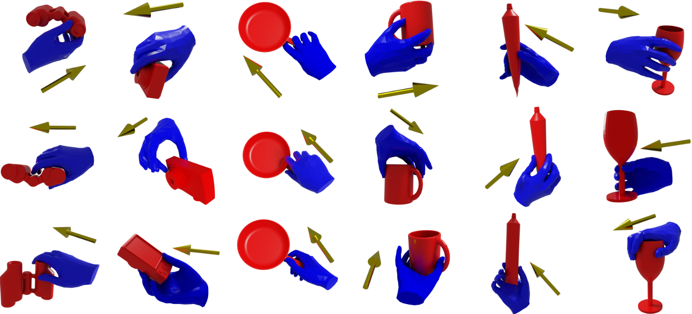

# CGrasp
This repository is the official implementation of the CGrasp model from 
our __3DV 2025__ paper:

**3D Whole-body Grasp Synthesis with Directional Controllability**
(https://gpaschalidis.github.io/cwgrasp/).

<a href="">

</a>

<p align="justify">
CGrasp is a generative model for hand grasp generation, conditioned on a given direction. The generated
hand follows the specified direction. 
</p>

## Installation & Dependencies
Clone the repository using:

```bash
git clone git@github.com:gpaschalidis/cgrasp.git
cd cgrasp
```
Run the following commands:
```bash
conda create -n cgrasp python=3.9 -y
conda activate cgrasp
conda install pytorch=2.3.0 torchvision torchaudio pytorch-cuda=12.1 -c pytorch -c nvidia
pip install "git+https://github.com/facebookresearch/pytorch3d.git@stable"
pip install kaolin==0.16.0 -f https://nvidia-kaolin.s3.us-east-2.amazonaws.com/torch-2.3.0_cu121.html
pip install git+https://github.com/otaheri/chamfer_distance.git
pip install git+https://github.com/otaheri/MANO.git
pip install git+https://github.com/otaheri/bps_torch.git
pip install -r requirements.txt
 ```
```bash
pip install -r requirements.txt
 ```
## Getting started


#### Mano models
- Download MANO models following the steps on the [MANO repo](https://github.com/otaheri/GrabNet) (skip this part if you already followed this for [GRAB dataset](https://github.com/otaheri/GRAB)).

#### GrabNet data (only required for retraining the model or testing on the test objects)
- Download the GrabNet dataset (ZIP files) from [this website](http://grab.is.tue.mpg.de). Please do NOT unzip the files yet.
- Put all the downloaded ZIP files for GrabNet in a folder.

- Run the following command to extract the ZIP files.

    ```Shell
    python cgrasp/data/unzip_data.py   --data-path $PATH_TO_FOLDER_WITH_ZIP_FILES \
                                        --ectract-path $PATH_TO_EXTRACT_DATASET_TO
    ```
- The extracted data should be in the following structure.
```bash
    GRAB
    ├── data
    │    │
    │    ├── bps.npz
    │    └── obj_info.npy
    │    └── sbj_info.npy
    │    │
    │    └── [split_name] from (test, train, val)
    │          │
    │          └── frame_names.npz
    │          └── grabnet_[split_name].npz
    │          └── data
    │                └── s1
    │                └── ...
    │                └── s10
    └── tools
         │
         ├── object_meshes
         └── subject_meshes
```

#### CoarseNet and RefineNet models
- To test CGrasp you need the pre trained refinenet model from GrabNet. Download this model from the [GRAB website](https://grab.is.tue.mpg.de), 
and move the model file to the models folder as described below.
```bash
     cgrasp
        └── grabnet
              └── models
                     └── refinenet.pt
             
        
```
## Train CGrasp
To train CGrasp from scratch use the following command:

```bash

```

## Generate Grasps
To try CGrasp and visualize the generated grasps together with the input grasp directions:

- First download our pre-trained model from [here]().
- And then run the following command:

```bash

```

## Citation
If you found this work influential or helpful for your research, please cite:
```
@InProceedings{paschalidis20243d,
  title     = {3D Whole-body Grasp Synthesis with Directional Controllability},
  author    = {Paschalidis, Georgios and Wilschut, Romana and Anti{\'c}, Dimitrije and Taheri, Omid and Tzionas, Dimitrios},
  booktitle = {International Conference on 3D Vision (3DV)},
  year      = {2025}
 }
```
